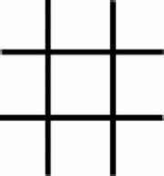
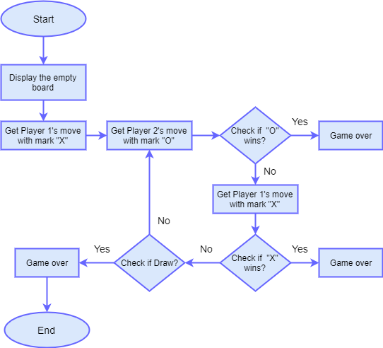
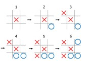

# TIC-TAC-TOE-GAME

EE-551 Python Project

### OBJECTIVE:
This project for EE-551 aims to develop a Tic Tac Toe game using python. It mainly consists of developing and implementing a computer program that plays Tic Tac Toe against another player. 
In order to understand what Tic Tac Toe game is and how to play the game, below is the description.

### GAME DESCRIPTION:
Tic Tac Toe is a two-player game (one of them being played by computer or human). In this game, there is a board with 3 x 3 squares as shown in this figure below. 

The two players take turns putting marks on a 3x3 board. The goal of Tic Tac Toe game is to be one of the players to get three same symbols in a row - horizontally, vertically or diagonally on a 3 x 3 grid.  The player who first gets 3 of his/her symbols (marks) in a row - vertically, horizontally, or diagonally wins the game, and the other loses the game. 
The game can be played by two players. There are two options for players: (a) Human  (b) Computer

### GAME RULES:
A player can choose between two symbols with his opponent, usual game uses “X” and “O”. 
1.	The player that gets to play with the "X" marks will play first (we call him/her player 1) and the player that gets to play with the "O" marks will play second (we call him/her player 2).

2.	Player 1 and 2 take turns making moves with Player 1 playing mark “X” and Player 2 playing mark “O”.

3.	A player marks any of the 3x3 squares with his mark (“X” or “O”) and their aim is to create a straight line horizontally or vertically or diagonally with two intensions: 
a.	One of the players gets three of his/her marks in a row (vertically, horizontally, or diagonally) i.e. that player wins the game. 
b.	If no one can create a straight line with their own mark and all the positions on the board are occupied, then the game ends in a  draw/tie.

### IMPLEMENTATION PLAN:
The implementation workflow for this project will be as follows:

In order to visualize the defined game rules and description, the game is shown in Figures below.

First the game will start with empty board.

Then Player 1 will make his/her move by playing mark “X” on this board. Then Player 2 will make his/her move by playing mark “O” on this board. This will keep on continuing until the board is full of marks.

Then the program will check if Player 1 with “X” wins or Player 2 with “O” wins and that scenario will be follows: (could be vertically, horizontally or diagonally). If none of the players win, the game is draw. All this decision making is done by using Minimax algorithm.

If none of the players win, the program will check for draw.

All the above defined game rules and this implementation workflow will be taken into consideration while designing a Python program for this project.

### Minimax Algorithm

Minimax is a artificial intelligence algorithm applied to a two player Tic Tac Toe game. This games are known as zero-sum games, because in a mathematical representation: one player wins (+1) and other player loses (-1) or both of anyone not to win (0).

Minimax is a recursive algorithm which is used to choose the best move that leads the Max player to win or not lose (draw). It consider the current state of the game and the available moves at that state, then for each valid move it plays (alternating min and max) until it finds a terminal state - win, draw or lose.

Its goal is to minimize the maximum loss i.e. minimize the worst case scenario.

#### Looking at a Brief Example

To apply this, let's take an example from near the end of a game, where it is my turn. I am X. My goal here, obviously, is to maximize my end game score.

If the top of this image represents the state of the game I see when it is my turn, then I have some choices to make, there are three places I can play, one of which clearly results in me wining and earning the 10 points. If I don't make that move, O could very easily win. And I don't want O to win, so my goal here, as the first player, should be to pick the maximum scoring move.

#### But What About O?

We should assume that O is also playing to win this game, but relative to us, the first player, O wants obviously wants to chose the move that results in the worst score for us, it wants to pick a move that would minimize our ultimate score. Let's look at things from O's perspective, starting with the two other game states from above in which we don't immediately win.

The choice is clear, O would pick any of the moves that result in a score of -10.

#### Describing Minimax
